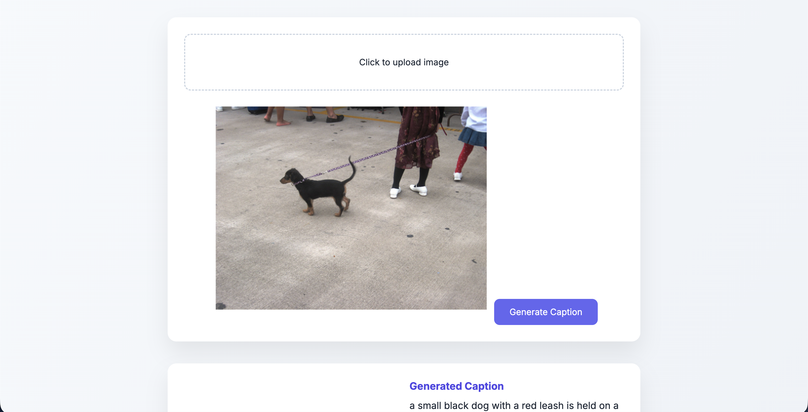

# Image Caption Generator 🖼️📝

An AI-powered web application that generates meaningful natural language captions for images using deep learning.  
The project combines **Computer Vision** and **Natural Language Processing** to understand images and describe them in words.

---

## 🚀 Features

- Upload an image and generate an AI-based caption
- CNN-based image feature extraction (EfficientNet)
- LSTM-based sequence model for caption generation
- Flask backend for model inference
- Clean and modern user interface
- Pretrained model loading (no retraining required)

---

## Demo



## 🧠 How It Works (Workflow)

1. User uploads an image through the web interface
2. A pretrained CNN (EfficientNet) extracts visual features from the image
3. An LSTM-based decoder generates a caption word-by-word
4. The generated caption is displayed along with the uploaded image

Image → CNN (feature extraction) → LSTM (caption generation) → Output caption


---

## 🏗️ Architecture

- **CNN (EfficientNetB0)**  
  Used for extracting high-level visual features from images (transfer learning with ImageNet weights)

- **LSTM Decoder**  
  Generates captions sequentially based on extracted image features and previously generated words

- **Tokenizer**  
  Converts words to numerical sequences for model input

---

## 🧑‍💻 Tech Stack

- **Python**
- **TensorFlow / Keras**
- **Flask**
- **HTML, CSS, JavaScript**
- **NumPy, Pillow, OpenCV**

---

## 📁 Project Structure


image-captioning-generator-app/
│
├── app.py # Flask application
├── utils.py # Model loading and inference logic
├── requirements.txt
├── README.md
│
├── model/
│ ├── image_caption_model.keras
│ └── tokenizer.pkl
│
├── templates/
│ └── index.html
│
├── static/
│ ├── css/
│ └── js/
│
├── uploads/
│ └── .gitkeep
│
└── training_notebook.ipynb # Model training workflow


---

## ⚙️ How to Run Locally

### 1️⃣ Clone the repository
```bash
git clone https://github.com/jatin-35asd/image-captioning-generator-app.git
cd image-captioning-generator-app

2️⃣ Create and activate virtual environment
python3 -m venv venv
source venv/bin/activate

3️⃣ Install dependencies
pip install -r requirements.txt

4️⃣ Run the application
python app.py


Open your browser and visit:

http://127.0.0.1:5000

📊 Dataset Information

The model was trained on the Flickr8k dataset

Due to large size constraints, the dataset is not included in this repository

Only the trained model and tokenizer are stored for inference

⚠️ Limitations

Trained on a small dataset (Flickr8k), so captions may be biased toward common human-centric scenes

Does not include attention mechanism or beam search

Performance can be improved with larger datasets (e.g., MS COCO)

🔮 Future Improvements

Add attention-based captioning

Implement beam search decoding

Train on larger datasets for better generalization

Deploy application to cloud platforms (Render / Railway / HuggingFace)

👨‍💻 Author

Jatin Jangra

GitHub: https://github.com/jatin-35asd

